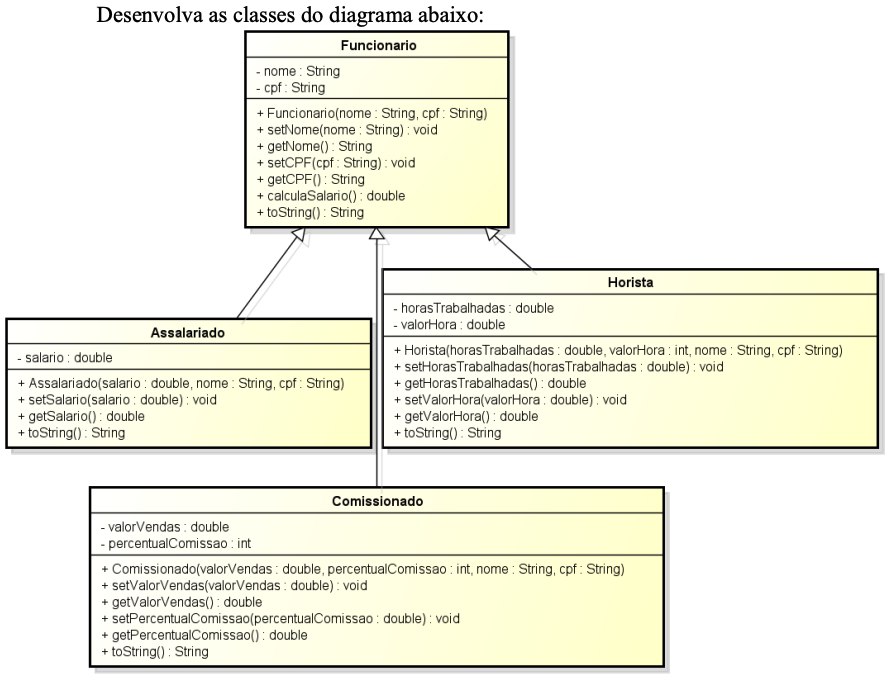

# Trabalho II POO

Turma: 20222GR.ADS011

Nome: Rafael Ramos

## Diagrama de classes do sistema

## Requisitos
O método `calculaSalario()` deve ser sobrescrito nas três classes que herdam
`Funcionário` das seguintes formas:

- `Assalariado:` retornar o valor do atributo salario
- `Comissionado:` calcular o valor a ser retornado utilizando o percentual
  de comissão sobre o valor de vendas.
- `Horista:` calcular o valor a ser retornado utilizando o total de horas
  trabalhadas e o valor da hora.

Crie também a classe `Loja` a qual deve possuir uma (e somente uma) **lista de
Funcionários** e métodos que permitam as seguintes operações:

1. Cadastrar `Assalariado`
2. Cadastrar `Horista`
3. Cadastrar `Comissionado`
4. Listar todos `Funcionários`
5. Listar `Assalariados`
6. Listar `Horistas`
7. Listar `Comissionados`
8. Calcular o valor total da folha de pagamento

Crie a classe `Principal` a qual deve instanciar um objeto do tipo `Loja` e
adicionar mais de um de cada tipo de `funcionário`. Após **testar todos os
métodos da classe `Loja`.**